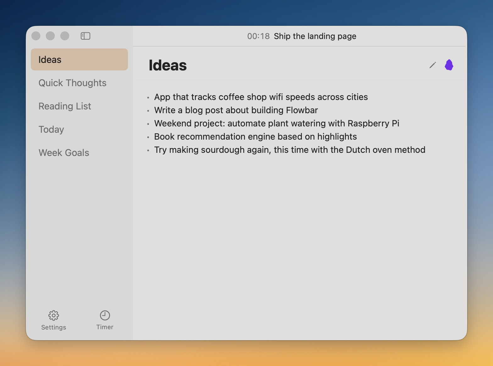
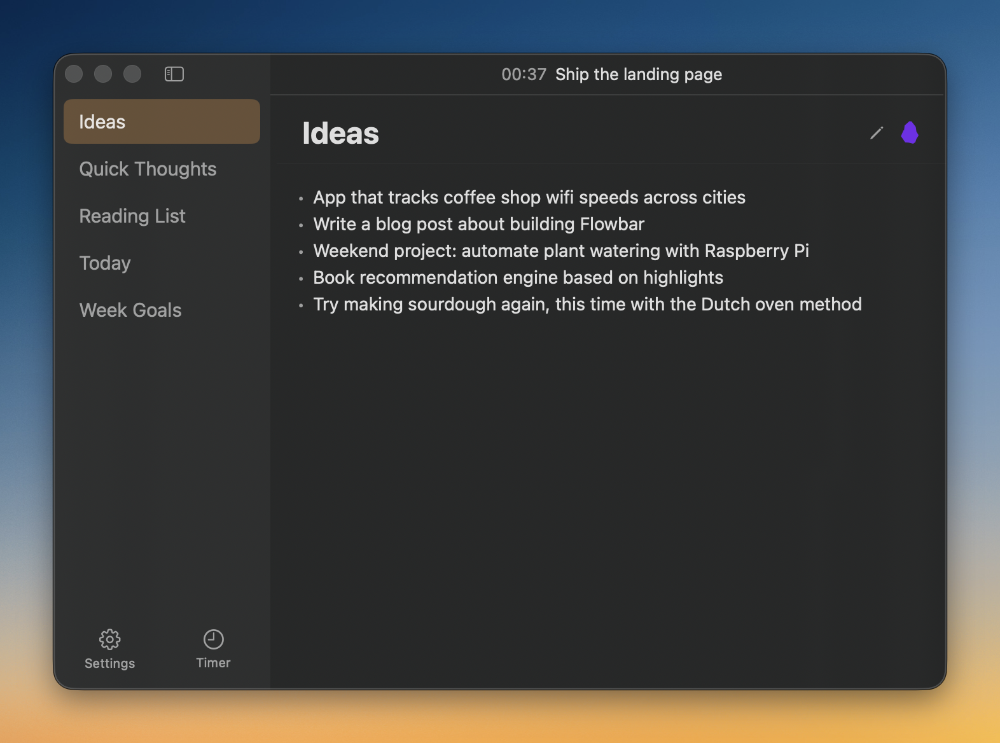

# [Flowbar](https://flowbar.tushar.ai)

| Light mode | Dark mode |
| --- | --- |
|  |  |


A native macOS menubar app for quick access to a folder of markdown notes and todos with integrated time tracking to help you focus. Opens as a window overlay on top of whatever else you're doing with the shortcut double Fn. 

I use Obsidian but wanted something lighter so I can check/edit todos and notes without opening the full app. I built this app which is pointed to a directory in my Obsidian vault.

Click the Flowbar icon in your menubar or double press `Fn` key and a floating overlay appears with your notes right there. Edit them, check off todos, track time on tasks. Click the icon again or double-tap Fn to toggle it from anywhere.

## Features

- **Clean Minimal Interface** - well thought UX, built with taste
- **Floating overlay panel** — toggle the app overlay with double-tap Fn, or from menubar
- **Resizable window** - with dimensions remembered across invocations
- **Keyboard Controlled** - check settings for the keyboard shortcuts to navigate around the app.
- **Smart editor** — auto-continues bullets, todos, and numbered lists on Enter; preserves indentation
- **Markdown Preview** - renders your checkboxes as todos, which can be toggled with ease
- **Todo list** — aggregated view of all todos across your markdown files and ability to check them off, which updates the source file. Markdown files remain the source of truth.
- **Timer** — stopwatch to start on any todo and track time against it
- **Timeline** - timeline of the day showing time spent on each todo
- **Quick search** — hit ⌘K to search across all notes by filename and content
- **Personalization** - Theme, color and font size
- **Open in Obsidian** - One click button to open your note in Obsidian(assuming it's part of your vault)

## Download & Install

1. Grab the latest **Flowbar.dmg** from the [Releases page](https://github.com/triptu/flowbar/releases/latest).
2. Open the DMG and drag **Flowbar** into your **Applications** folder.
3. Launch Flowbar — macOS will show a security warning because the app isn't notarized (Apple charges $$ for a certificate, and this is a free side project).
4. Open **System Settings → Privacy & Security**, scroll down, and click **"Open Anyway"**. You only need to do this once.

> The DMG is built automatically by [GitHub Actions](https://github.com/triptu/flowbar/actions) from the public source code — you can verify the build or build from source yourself (see below).

## How to build & run

Checkout [learn-swift](https://flowbar.tushar.ai/learn-swift) for a guide to the Swift concepts and patterns used in Flowbar.

You need Xcode installed (tested on Xcode 16+, macOS 15+).

```bash
# Generate the Xcode project (only needed once, or after changing project.yml)
cd Flowbar
xcodegen generate

# Build
xcodebuild -project Flowbar.xcodeproj -scheme Flowbar -configuration Debug build

# Run the app
open ~/Library/Developer/Xcode/DerivedData/Flowbar-*/Build/Products/Debug/Flowbar.app
```

Or just open `Flowbar.xcodeproj` in Xcode and hit Run.

First launch: click the Flowbar icon in your menu bar, go to Settings, and point it at a folder with md files(you can create one inside your Obsidian vault if using Obsidian).

## Contributing

This is a personal project, but if you find a bug or want to suggest an improvement, feel free to open an issue or submit a pull request. I'm happy to review and merge contributions that align with the minimalist design and core functionality.

If using claude code, use this command - "/flowbar-dev [the change you want to make]" for ease of development and consistency.
